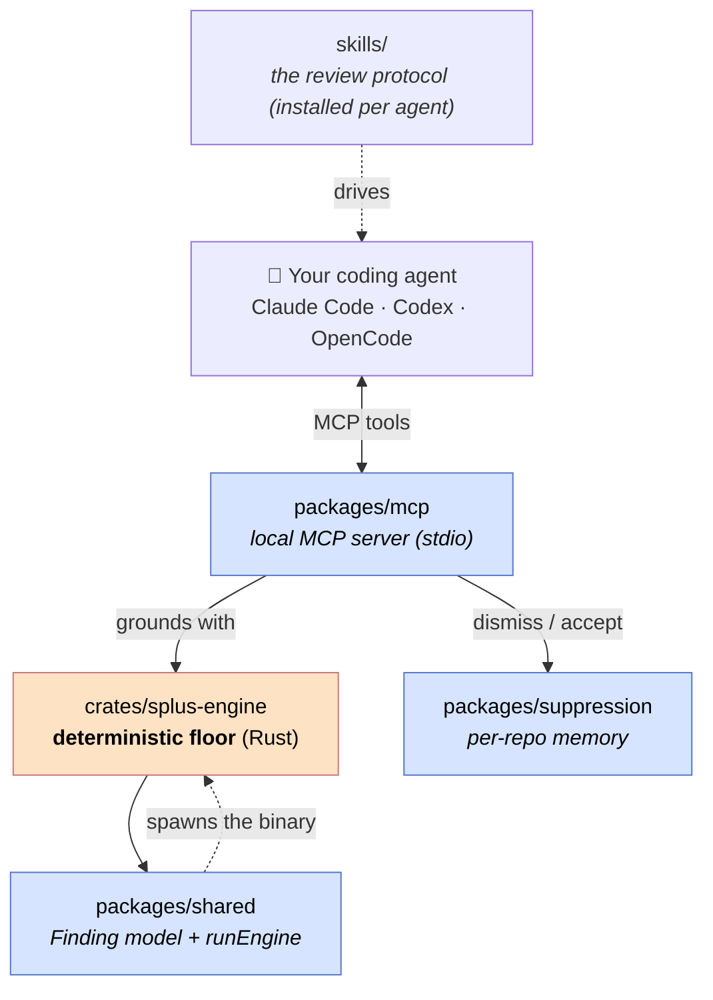
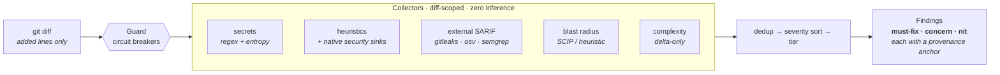
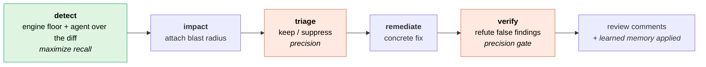
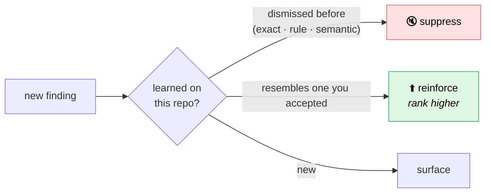

# Architecture

Splus has one job: make the coding agent already in your editor a **disciplined,
diff-scoped, grounded, learning reviewer**. It does that with a deterministic Rust
engine (the grounding) and a thin TypeScript layer (the orchestration + memory).
Nothing leaves your machine.

The engine **grounds**; the agent **reviews**. Splus never claims to be a smarter
model than the one you already run — it makes that model disciplined.

## The pieces

| Package | Language | Role |
|---|---|---|
| `crates/splus-engine` | Rust | The deterministic floor. Parses the diff, runs collectors, emits canonical `Finding`s. The source of truth — zero inference. |
| `packages/shared` | TS | The canonical `Finding` / `Report` model (mirrors the Rust serde model) + `runEngine`, which shells out to the binary and validates its JSON. |
| `packages/suppression` | TS | Per-repo learned memory: suppress what you `dismiss`, reinforce what you `accept`. The compounding moat. |
| `packages/mcp` | TS | The local stdio MCP server your agent connects to — **the one and only way to use Splus**. Wires the engine + suppression together and exposes the tools. |
| `skills/` | md | The review protocol as first-class skills. `install.sh` installs them into every detected agent (Claude Code skills, Codex prompts, OpenCode commands; canonical copy at `~/.splus/skills`) so the protocol doesn't depend on MCP tool descriptions being read. |

## The deterministic floor (the engine)

Everything is **diff-scoped** — only newly-added lines are ever considered
(clean-as-you-code).

The pipeline (`crates/splus-engine/src/pipeline.rs`):

0. **Guard** — circuit breakers (max files / added lines, generated/vendored) bound cost.
1. **Diff** — `git` added-line set per changed file.
2. **Collectors** (`src/collectors/`):
   - `secrets` — regex + Shannon-entropy gate (AWS, GitHub, private keys, …).
   - `heuristics` — language-gated syntactic rules incl. **native security sinks** (unsafe `yaml.load`/`pickle`/`eval`/`shell=True`, SQL string-interpolation, TLS-verify-off, JS SQL templates, `dangerouslySetInnerHTML`).
   - `external` — best-effort SARIF adapters **if present on PATH**: gitleaks, osv-scanner, semgrep (offline only), ast-grep.
   - `blast_radius` — cross-file caller graph for changed exports. **Precise (SCIP, compiler-grade)** when an `index.scip` exists; name+import heuristic otherwise.
   - `complexity` — cognitive-complexity **delta** base→head. On by default; the delta-only scoring keeps unchanged code silent (`--no-metrics` to disable).
3. **Dedup → severity sort → tier** (`must-fix` / `concern` / `nit`).

Every `Finding` carries a provenance **anchor** (`secret` / `metric` / `graph-edge`
/ `sarif` / `heuristic`) and a stable fingerprint. Deep analysis (tree-sitter symbols,
cognitive complexity, per-language security heuristics) covers the **top 15 languages** —
TypeScript, JavaScript (+TSX/JSX), Python, Java, C#, C++, C, Go, Rust, PHP, Ruby, Kotlin,
Swift, Scala, Shell/Bash. The control-flow + symbol node vocabulary for each is a data table
in `analysis/langspec.rs`, so the complexity walker and symbol collector are language-agnostic;
adding a language is "fill in the node names + verifying test". The blast-radius heuristic graph
is JS/TS-only (it models JS module resolution); the SCIP precise tier resolves any of the 15.
Languages outside the set degrade to secrets + universal heuristics.

## The review protocol (the agent)

The engine grounds; the agent reviews. There is **one flow** and the agent in the
chair is the driver — no API key, no headless alternative to choose between.
`review` returns the grounded findings + a **discovery directive** that drives
*your* agent through the protocol below: detect (engine floor + the agent reading
the diff), attach impact, triage keep/suppress, remediate, and VERIFY (refute)
each finding before posting.

  - **detect** — engine findings (grounded) + the agent's pass over the **diff** that hunts every plausible bug (recall-first).
  - **impact** — cross-file blast radius attached so the review reasons about consequences.
  - **triage** — keep/suppress + severity + confidence (precision).
  - **remediate** — a concrete fix per kept finding.
  - **verify** — an adversarial pass that **refutes** plausible-but-wrong findings and drops them. This is the precision gate that keeps discovery from leaking noise.

## Memory (`dismiss` / `accept`)

Stored per-repo in `.splus-cache/learnings.json` (checked into your repo). Negative
memory suppresses noise you `dismiss` (exact · rule · semantic); positive memory
reinforces findings you `accept`. Security findings are exempt from *semantic*
suppression — a dismissed test fixture can never silence a real secret.

## The MCP tools

`review` · `inspect` · `floor` · `preferences` · `recall` · `note` · `dismiss` ·
`accept` · `mute` · `learnings` · `report` · `index`. See
[TOOLS.md](TOOLS.md) for every parameter and return shape.

## Distribution

`install.sh` downloads the engine + the bundled MCP server (`dist-release/mcp.cjs`)
into `~/.splus`, verifies the optional gitleaks/osv-scanner adapters against their
upstream SHA-256 manifests, and wires the MCP server into every coding agent it
finds. Existing installs enter compact update mode and preserve agent wiring unless
`SPLUS_REWIRE=1` is set. Releases are cut by tagging `v*`
(`.github/workflows/release.yml`).
