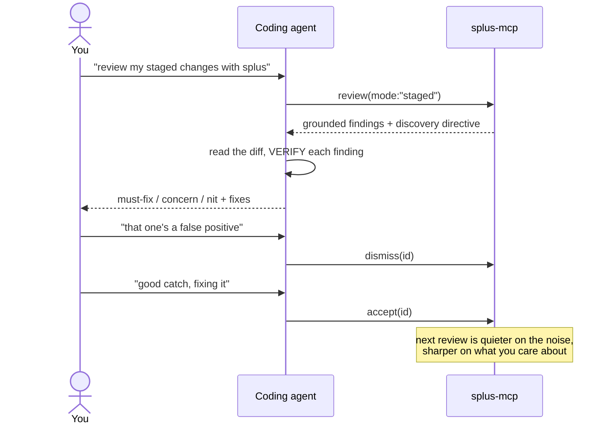

# MCP tools reference

Splus is a local **MCP server** (`splus-mcp`). Your coding agent connects to it
over stdio and calls these six tools. Everything runs on your machine; no LLM runs
in the server process unless you pass `llm: true` (which needs `ANTHROPIC_API_KEY`).

| Tool | Mutates? | What it's for |
|---|---|---|
| [`review`](#review) | no | Review the diff — grounded findings + drive the agent's discovery pass. |
| [`dismiss`](#dismiss) | yes | Teach Splus a finding is **noise** (suppresses close variants). |
| [`accept`](#accept) | yes | Teach Splus a finding was **real** (reinforces close variants). |
| [`mute`](#mute) | yes | Silence an entire rule for this repo. |
| [`learnings`](#learnings) | no | List what's been learned on this repo. |
| [`index`](#index) | yes | Build a SCIP index for compiler-grade blast radius. |

## Typical flow



---

## `review`

Run Splus on **new/changed lines only** (clean-as-you-code), entirely local.
Returns findings grouped `must-fix` / `concern` / `nit`, each with `file:line`, a
rule id, severity, confidence, a deterministic provenance **anchor**, an optional
fix, and cross-file **blast radius**. Learned suppressions are applied first.

By default **no LLM runs** — the response ends with a **discovery directive** that
drives *you* (the agent) through the senior-reviewer pass over the changed files.
That's the design: Splus grounds you with precise anchors; you do the reasoning.

| Param | Type | Default | Description |
|---|---|---|---|
| `root` | string | server CWD | Absolute path to the git repo root. |
| `mode` | `working` \| `staged` \| `base` \| `all` | `working` | `working` = uncommitted vs HEAD; `staged` = the index (pre-commit); `base` = PR-style `base..HEAD`; `all` = the whole repo as if newly written. |
| `base` | string | — | Base ref (branch/sha) — required when `mode: "base"`. |
| `applyLearnings` | boolean | `true` | Apply this repo's learned suppressions. |
| `llm` | boolean | `false` | Also run the headless LLM layer (needs `ANTHROPIC_API_KEY`). |
| `thorough` | boolean | `false` | With `llm`, run the full discovery + verify pass. |
| `discovery` | boolean | `true` | Append the directive that drives the agent's review. |
| `precise` | boolean | `false` | Build a SCIP index first so blast radius is compiler-grade (~97% vs ~60%). Slower; needs the project's deps. |

**Returns** (deterministic path): a one-line summary, then JSON with `summary`,
`findings[]` (each with `id`, `file`, `line`, `severity`, `tier`, `ruleId`,
`category`, `anchor`, `confidence`, `suggestion`, `blastRadius`), `suppressed[]`,
any `reinforced` ids, and the discovery directive. With `llm: true`, returns the
triaged report instead (kept/suppressed + per-finding rationale + verify counts).

```jsonc
// review(mode: "staged")
{ "summary": { "mustFix": 1, "concern": 2, "nit": 0, "suppressedByLearnings": 3 },
  "findings": [
    { "id": "a1b2…", "file": "api/auth.py", "line": 42, "severity": "high",
      "tier": "must-fix", "ruleId": "security.python-sql-fstring",
      "anchor": "heuristic: pattern security.python-sql-fstring",
      "confidence": 0.6, "suggestion": "cur.execute(\"… WHERE id = %s\", (uid,))",
      "blastRadius": null } ] }
```

> **Agent etiquette:** do the discovery pass — don't just relay the findings.
> VERIFY each candidate against the cited line before posting; a wrong comment
> costs more than a missed nit.

---

## `dismiss`

Teach Splus a finding is a false positive / noise on **this repo**, by its `id`
from a prior review. The dismissal **generalizes**: semantically-similar findings
(even in other files) are auto-suppressed going forward. Call it when the user
agrees something isn't worth flagging.

| Param | Type | Default | Description |
|---|---|---|---|
| `root` | string | server CWD | Repo root. |
| `id` | string | — | The finding `id` (fingerprint) to dismiss. |
| `ruleId` | string | — | The finding's rule id — improves generalization if it's no longer in the diff. |
| `mode` / `base` | — | `working` | Where to look up the finding's text for semantic matching. |

> Secret/security rules are **exempt from semantic** suppression — they can only be
> silenced by an exact dismissal or an explicit `mute`, so a dismissed fixture can
> never hide a real secret.

---

## `accept`

The inverse of `dismiss`: teach Splus a finding was **real and worth surfacing**.
It never suppresses anything — it builds **positive memory** so future findings
resembling this confirmed-real one are **reinforced** (ranked higher). Call it when
the user acts on / agrees with a finding (including agent-discovered ones).

| Param | Type | Default | Description |
|---|---|---|---|
| `root` | string | server CWD | Repo root. |
| `id` | string | — | The finding `id` to accept. |
| `ruleId` | string | — | The finding's rule id (improves reinforcement matching). |
| `text` | string | — | The finding's text — pass it for **agent-discovered** findings that aren't in the engine's output. |
| `mode` / `base` | — | `working` | Where to recover the finding's text. |

---

## `mute`

Silence an **entire rule** on this repo (e.g. `hygiene.python-print`). Stronger than
`dismiss` — every finding with that rule id is suppressed regardless of file or
wording. Use when the user never wants this class flagged here.

| Param | Type | Description |
|---|---|---|
| `root` | string | Repo root. |
| `ruleId` | string | The rule id to mute. |

---

## `learnings`

List everything learned on this repo (dismissals, mutes, accepts) from
`.splus-cache/learnings.json`. Read-only.

| Param | Type | Description |
|---|---|---|
| `root` | string | Repo root. |

---

## `index`

Build a compiler-grade **SCIP index** so cross-file blast radius resolves precisely
(~97% vs the ~60% name heuristic). Runs the local Sourcegraph indexer
(`scip-typescript` / `scip-python`) and writes `.splus-cache/index.scip`, which
`review` auto-detects. Needs the project's deps installed; meant for occasional / CI
use, not the hot path (or use `review(precise: true)`).

| Param | Type | Description |
|---|---|---|
| `root` | string | Repo root. |

---

See [ARCHITECTURE.md](ARCHITECTURE.md) for how the engine and the review protocol
work under the hood.
