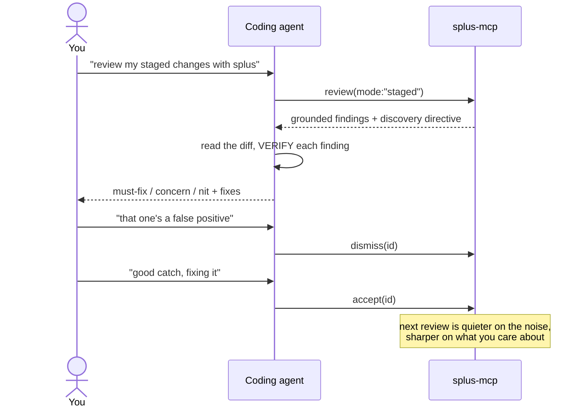

# MCP tools reference

Splus is a local **MCP server** (`splus-mcp`). Your coding agent connects to it
over stdio and calls these tools. Everything runs on your machine — there is no
API key and no cloud step; the coding agent connected over stdio is the reviewer.

| Tool | Mutates? | What it's for |
|---|---|---|
| [`review`](#review) | no | Read `SPLUS.md`, return the floor, drive the agent's review. |
| [`inspect`](#inspect) | no | The engine **on tap** — one code-intelligence question on demand. |
| [`floor`](#floor) | no | Re-ground on the deterministic finding floor for a scope. |
| [`preferences`](#preferences) | no | Show the merged `SPLUS.md` contract. |
| [`recall`](#recall) | no | Surface confirmed findings / conventions for a hunk. |
| [`note`](#note) | yes | Remember a discovered repo convention (→ `recall`). |
| [`dismiss`](#dismiss) | yes | Teach Splus a finding is **noise** (suppresses close variants). |
| [`accept`](#accept) | yes | Teach Splus a finding was **real** (reinforces; becomes recallable). |
| [`mute`](#mute) | yes | Silence an entire rule for this repo. |
| [`learnings`](#learnings) | no | List what's been learned on this repo. |
| [`report`](#report) | no | Render the review as a standalone offline HTML report. |
| [`index`](#index) | yes | Build a SCIP index for compiler-grade blast radius. |

## Typical flow



---

## `review`

Run Splus on **new/changed lines only** (clean-as-you-code), entirely local.
Returns findings grouped `must-fix` / `concern` / `nit`, each with `file:line`, a
rule id, severity, confidence, a deterministic provenance **anchor**, an optional
fix, and cross-file **blast radius**. Learned suppressions are applied first.

There is **one flow** and you are the driver: the response begins with the repo's
[`SPLUS.md`](#preferences) contract (preferences injected, binding `mute:`/`skip:`
rules already enforced) and ends with a **discovery directive** that drives *you*
(the agent) through the full protocol (triage → investigate → verify) over the
changed files. No API key — Splus grounds you with precise anchors and a toolbelt
(`inspect`, `floor`, `recall`); you do the reasoning. Run the protocol; don't relay.

| Param | Type | Default | Description |
|---|---|---|---|
| `root` | string | server CWD | Absolute path to the git repo root. |
| `mode` | `working` \| `staged` \| `base` \| `all` | `working` | `working` = uncommitted vs HEAD; `staged` = the index (pre-commit); `base` = PR-style `base..HEAD`; `all` = the whole repo as if newly written. |
| `base` | string | — | Base ref (branch/sha) — required when `mode: "base"`. |
| `applyLearnings` | boolean | `true` | Apply this repo's learned suppressions. |
| `precise` | boolean | `false` | Build a SCIP index first so blast radius is compiler-grade (~97% vs ~60%). Slower; needs the project's deps. |

**Returns**: a one-line summary, then JSON with `summary`, `findings[]` (each with
`id`, `file`, `line`, `severity`, `tier`, `ruleId`, `category`, `anchor`,
`confidence`, `suggestion`, `blastRadius`), `suppressed[]`, any `reinforced` ids,
and the discovery directive that drives your review.

```jsonc
// review(mode: "staged")
{ "summary": { "mustFix": 1, "concern": 2, "nit": 0, "suppressedByLearnings": 3 },
  "findings": [
    { "id": "a1b2…", "file": "api/auth.py", "line": 42, "severity": "high",
      "tier": "must-fix", "ruleId": "security.python-sql-fstring",
      "anchor": "heuristic: pattern security.python-sql-fstring",
      "confidence": 0.6, "suggestion": "cur.execute(\"… WHERE id = %s\", (uid,))",
      "blastRadius": null } ] }
```

> **Agent etiquette:** do the discovery pass — don't just relay the findings.
> VERIFY each candidate against the cited line before posting; a wrong comment
> costs more than a missed nit.

---

## `inspect`

The engine **on tap** — ask one deterministic question while you investigate,
instead of triaging a list. JS/TS-aware (the same honest name+import tier as blast
radius, SCIP-precise for `blast_radius` when an index exists); non-JS/TS symbols
return an honest empty answer.

| Param | Type | Description |
|---|---|---|
| `kind` | `definition` \| `callers` \| `blast_radius` \| `complexity` \| `exports` \| `imports` | Which question to ask. |
| `target` | string | A **symbol** (definition/callers/blast_radius) or a **file path** (complexity/exports/imports). |
| `file` | string | Pin the defining file for a symbol query (disambiguates same-named symbols). |
| `root` | string | Repo root. |

```jsonc
// inspect(kind: "callers", target: "validateToken")
{ "kind": "callers", "symbol": "validateToken", "defFile": "src/utils/auth.ts",
  "directCallers": ["src/api/login.ts"], "transitiveCallers": 0, "crossesApiBoundary": true }
```

> Use it: for every changed export, `inspect blast_radius` and open the call sites
> before you conclude the change is safe. Recurse when a hunk smells off.

---

## `floor`

Return the engine's deterministic finding **floor** for a scope as JSON — the same
grounded set `review` starts from, without the directive. The repo's `SPLUS.md`
binding rules are applied; learned suppression is not. Use it to re-check a scope
mid-investigation.

| Param | Type | Default | Description |
|---|---|---|---|
| `root` | string | server CWD | Repo root. |
| `mode` | `working` \| `staged` \| `base` \| `all` | `working` | Scope. |
| `base` | string | — | Base ref — required when `mode: "base"`. |

---

## `preferences`

Return the merged [`SPLUS.md`](#) review contract for this repo (`./SPLUS.md`
layered over `~/.splus/SPLUS.md`), including its binding `mute:`/`skip:` rules.
`review` already injects it; call this to read it directly.

`SPLUS.md` is the repo's review contract, read **first** on every review: prose
preferences/nits guide the reviewer; `mute: <ruleId>` and `skip: <glob>` lines are
**binding** (matching findings are dropped and reported, never silently). The
`prefs` skill scaffolds one.

| Param | Type | Description |
|---|---|---|
| `root` | string | Repo root. |

---

## `recall`

Surface past confirmed-real findings (`accept`) and discovered conventions
(`note`) most relevant to a hunk, symbol, or question — so a reviewer's diligence
compounds across sessions. Semantic (embedding) match over `.splus-cache/memory.json`.

| Param | Type | Default | Description |
|---|---|---|---|
| `root` | string | server CWD | Repo root. |
| `query` | string | — | A hunk, symbol, error, or question to recall memories for. |
| `limit` | number | `5` | Max memories to return. |

---

## `note`

Remember a repo convention you discovered while reviewing (e.g. "this module uses
`Result<T,E>`, never throws") so future reviews `recall` it. Complements `accept`.
Written to `.splus-cache/memory.json`; promotable into `SPLUS.md` for a binding rule.

| Param | Type | Description |
|---|---|---|
| `root` | string | Repo root. |
| `text` | string | The convention/context to remember, in one sentence. |
| `file` | string | The file/area it applies to, if specific. |

---

## `dismiss`

Teach Splus a finding is a false positive / noise on **this repo**, by its `id`
from a prior review. The dismissal **generalizes**: semantically-similar findings
(even in other files) are auto-suppressed going forward. Call it when the user
agrees something isn't worth flagging.

| Param | Type | Default | Description |
|---|---|---|---|
| `root` | string | server CWD | Repo root. |
| `id` | string | — | The finding `id` (fingerprint) to dismiss. |
| `ruleId` | string | — | The finding's rule id — improves generalization if it's no longer in the diff. |
| `mode` / `base` | — | `working` | Where to look up the finding's text for semantic matching. |

> Secret/security rules are **exempt from semantic** suppression — they can only be
> silenced by an exact dismissal or an explicit `mute`, so a dismissed fixture can
> never hide a real secret.

---

## `accept`

The inverse of `dismiss`: teach Splus a finding was **real and worth surfacing**.
It never suppresses anything — it builds **positive memory** so future findings
resembling this confirmed-real one are **reinforced** (ranked higher). Call it when
the user acts on / agrees with a finding (including agent-discovered ones).

| Param | Type | Default | Description |
|---|---|---|---|
| `root` | string | server CWD | Repo root. |
| `id` | string | — | The finding `id` to accept. |
| `ruleId` | string | — | The finding's rule id (improves reinforcement matching). |
| `text` | string | — | The finding's text — pass it for **agent-discovered** findings that aren't in the engine's output. |
| `mode` / `base` | — | `working` | Where to recover the finding's text. |

---

## `mute`

Silence an **entire rule** on this repo (e.g. `hygiene.python-print`). Stronger than
`dismiss` — every finding with that rule id is suppressed regardless of file or
wording. Use when the user never wants this class flagged here.

| Param | Type | Description |
|---|---|---|
| `root` | string | Repo root. |
| `ruleId` | string | The rule id to mute. |

---

## `learnings`

List everything learned on this repo (dismissals, mutes, accepts) from
`.splus-cache/learnings.json`. Read-only.

| Param | Type | Description |
|---|---|---|
| `root` | string | Repo root. |

---

## `report`

The final step of the review flow. Returns a self-contained HTML template (all
CSS/JS inline, opens offline) plus fill instructions; you fill the marked slots
with the verdict, your verified findings, and the file-level impact graph, and
write `splus-report.html` — the shareable artifact a dev keeps next to the diff.
Read-only; takes no parameters.

---

## `index`

Build a compiler-grade **SCIP index** so cross-file blast radius resolves precisely
(~97% vs the ~60% name heuristic). Runs the local Sourcegraph indexer
(`scip-typescript` / `scip-python`) and writes `.splus-cache/index.scip`, which
`review` auto-detects. Needs the project's deps installed; meant for occasional / CI
use, not the hot path (or use `review(precise: true)`).

| Param | Type | Description |
|---|---|---|
| `root` | string | Repo root. |

---

See [ARCHITECTURE.md](ARCHITECTURE.md) for how the engine and the review protocol
work under the hood.
